<!--
Developed by codemeshuggah
GitHub: https://github.com/codemeshuggah
-->

# ⚡ LectureFlow — AI-Automated Lecture Video Editing for Adobe Premiere Pro

[](https://opensource.org/licenses/MIT)
[](https://www.python.org/downloads/)
[](https://www.adobe.com/products/premiere.html)
[](https://modelcontextprotocol.io/)
[](https://github.com/codemeshuggah)

**LectureFlow** transforms raw, single-take video recordings and presentation slide decks into broadcast-ready, cleanly edited course lecture videos inside **Adobe Premiere Pro** in minutes.

---

## 🚀 Key Features

* **Interactive Intake**: Prompts for user media paths, brand assets, and slide skip settings upon launch.
* **Auto Slide Deck Ingest**: Extracts slides from PowerPoint (`.pptx`) as 1080p/4K PNGs, skips non-content title slides, and maps slide numbering **1:1** to the lecturer's spoken cues.
* **ASR Word-Level Timing**: Supports free, offline GPU transcription via [`faster-whisper`](https://github.com/SYSTRAN/faster-whisper) or cloud APIs (ElevenLabs Scribe / OpenAI Whisper).
* **Automated Cue & Retake Excision**: Detects verbal slide cues (*"Slide one"*, *"Slide two"*), retakes (*"Cut"*, *"Retake"*), and dead-air pauses.
* **Mathematical Right-to-Left Trimming**: Trims from the latest cue backward, guaranteeing **zero downstream timeline drift** between dialogue, slides, and background tracks.
* **Chroma Key & Motion PIP Layout**: Automatically applies calibrated **Ultra Key** (without cumbersome garbage masking) and transitions the presenter from a centered welcome greeting into a sleek Picture-in-Picture (PIP) layout.
* **Overlay Track Protection**: Automatically locks overlay layers (e.g. Video 2) to safeguard lower-thirds, captions, and title cards.

---

## 📐 Architecture & Track Layout

```mermaid
gantt
    title LectureFlow Track Architecture
    dateFormat X
    axisFormat %s

    section Video 3 (Presenter & Intro)
    Brand Logo Reveal (3s)       :active, 0, 3
    Instructor Intro Card (4s)  :crit, 3, 7
    Reserved Module Slot (5s)   :milestone, 7, 12
    Presenter Welcome (Center)  :12, 28
    Presenter Lecture (PIP)     :28, 700

    section Video 1 (Slides & Outro)
    Presenter Background Grid   :12, 28
    Slide 01 (Learning Obj)     :28, 65
    Slide 02 (Content)          :65, 130
    Slide 03...                 :130, 680
    Animated Outro (20s)        :crit, 680, 700

    section Audio 2 (Music Bed)
    Intro Music Bed (Anchored)  :0, 14.24

    section Audio 1 (Dialogue)
    Speaker Speech (Synced V3)  :12, 680
```



---

## 🛠️ Prerequisites & Setup Guide

### 1. Adobe Premiere Pro & MCP Bridge
LectureFlow communicates with Premiere Pro through the **Premiere Pro Model Context Protocol (MCP)** server, which interfaces between AI agents / automation scripts and Adobe's CEP (Common Extensibility Platform) ExtendScript runtime.

* **Requirements**: Adobe Premiere Pro 2024 (v24.x) or 2025/2026 (v25.x / v26.x).
* **Setting up the Premiere Pro CEP Bridge**:
  1. Clone or download the Premiere Pro MCP extension (e.g., from [leancoderkavy/premiere-pro-mcp](https://github.com/leancoderkavy/premiere-pro-mcp) or [hyperbrowser/premiere-pro-mcp](https://github.com/hyperbrowser/premiere-pro-mcp)).
  2. Copy the extension folder to your system Adobe CEP directory:
     - **Windows**: `C:\Program Files (x86)\Common Files\Adobe\CEP\extensions\`
     - **macOS**: `~/Library/Application Support/Adobe/CEP/extensions/`
  3. Enable unsigned CEP extensions (PlayerDebugMode):
     - **Windows (PowerShell)**:
       ```powershell
       Set-ItemProperty -Path "HKCU:\Software\Adobe\CSXS.11" -Name "PlayerDebugMode" -Value "1"
       Set-ItemProperty -Path "HKCU:\Software\Adobe\CSXS.12" -Name "PlayerDebugMode" -Value "1"
       ```
     - **macOS (Terminal)**:
       ```bash
       defaults write com.adobe.CSXS.11 PlayerDebugMode 1
       defaults write com.adobe.CSXS.12 PlayerDebugMode 1
       ```
  4. Launch Premiere Pro, open your project, and navigate to **Window > Extensions > Premiere Pro MCP** to start the bridge.

---

### 2. Connecting Your AI Agent via MCP

LectureFlow is designed to work seamlessly with any Model Context Protocol (MCP) enabled AI coding assistant or agentic environment:

#### 🪐 Option A: Google Antigravity IDE (Primary & Recommended)
Antigravity IDE provides native, autonomous pair-programming with deep MCP support and automatic skill discovery:
1. Add the Premiere Pro MCP server in your Antigravity MCP configuration (`~/.gemini/antigravity-ide/mcp/premiere-pro/` or `mcp_config.json`):
   ```json
   {
     "mcpServers": {
       "premiere-pro": {
         "command": "node",
         "args": ["C:/path/to/premiere-pro-mcp/build/index.js"]
       }
     }
   }
   ```
2. Open the **LectureFlow** workspace in Antigravity. It automatically detects `.agents/skills/LectureFlow/SKILL.md` as an active agent skill!
3. Simply prompt Antigravity:
   > *"Edit my lecture video using LectureFlow"*
   Antigravity will interactively ask for your media paths, run speech transcription, calculate right-to-left cut points, apply Ultra Key, and execute the edit on your timeline.

#### 💬 Option B: Anthropic Claude Desktop
1. Open your Claude Desktop MCP configuration file:
   - **Windows**: `%APPDATA%\Claude\claude_desktop_config.json`
   - **macOS**: `~/Library/Application Support/Claude/claude_desktop_config.json`
2. Add the `premiere-pro` MCP server entry:
   ```json
   {
     "mcpServers": {
       "premiere-pro": {
         "command": "node",
         "args": ["/path/to/premiere-pro-mcp/build/index.js"]
       }
     }
   }
   ```
3. Restart Claude Desktop. Load `SKILL.md` as your project prompt or instructions to give Claude full autonomous editing capabilities.

#### ⚡ Option C: Cursor IDE
1. Open Cursor and go to **Settings > Features > MCP**.
2. Click **Add New MCP Server**:
   - **Name**: `premiere-pro`
   - **Type**: `command`
   - **Command**: `node /path/to/premiere-pro-mcp/build/index.js`
3. Reference `SKILL.md` in Cursor Composer or Chat with `@SKILL.md`.

#### 🌊 Option D: Windsurf IDE (Codeium)
1. Add the server entry to `~/.codeium/windsurf/mcp_config.json`:
   ```json
   {
     "mcpServers": {
       "premiere-pro": {
         "command": "node",
         "args": ["/path/to/premiere-pro-mcp/build/index.js"]
       }
     }
   }
   ```
2. Cascade will automatically have access to Premiere Pro tools when editing your timeline.

### 3. FFmpeg Audio Extraction
FFmpeg is required to quickly demux raw video into 16kHz mono PCM audio for lightning-fast speech recognition.
* **Windows**:
  ```powershell
  winget install Gyan.FFmpeg
  ```
* **macOS**:
  ```bash
  brew install ffmpeg
  ```
* **Linux (Ubuntu/Debian)**:
  ```bash
  sudo apt update && sudo apt install ffmpeg
  ```

### 4. Python 3.10+ & Optional GPU Acceleration
* Install Python 3.10 or higher.
* *(Recommended)* An NVIDIA GPU with CUDA 12+ for instant local transcription via `faster-whisper`. If no CUDA GPU is present, it will automatically fall back to CPU or cloud ASR (ElevenLabs / OpenAI).

---

## 📦 Quick Start

### 1. Clone & Install
```bash
git clone https://github.com/codemeshuggah/LectureFlow.git
cd LectureFlow
pip install -r requirements.txt
```

### 2. Configure Environment
Copy `.env.example` to `.env` and configure your preferred speech engine:
```bash
cp .env.example .env
```

If using ElevenLabs Scribe or OpenAI Whisper, add your API key in `.env`:
```env
ASR_PROVIDER=local_whisper     # or 'elevenlabs' / 'openai'
ELEVENLABS_API_KEY=your_key_here
```

### 3. Run Pipeline
```bash
python -m src.cli \
  --video "path/to/lecture_recording.mp4" \
  --ppt "path/to/presentation.pptx" \
  --config "config.example.yaml"
```

---

## 💡 How the Right-to-Left Trimming Engine Works

When a speaker says *"Slide two"* or takes a retake, deleting that segment closes a gap and shifts all subsequent media to the left. If edits were performed left-to-right, every earlier cut would alter the timestamps of all future cuts, causing cumulative timing drift.

LectureFlow solves this by sorting all cuts in descending chronological order:

$$\text{Cut}_N \longrightarrow \text{Cut}_{N-1} \longrightarrow \dots \longrightarrow \text{Cut}_1$$

Because earlier timestamps exist strictly upstream of downstream cuts:
$$\text{Time}(\text{Cut}_k) < \text{Time}(\text{Cut}_{k+1})$$
Executing each cut from right to left guarantees that **upstream cut coordinates remain 100% invariant**, achieving zero drift across 20+ edits automatically.

---

## 📄 License & Credits
Developed with ❤️ by [codemeshuggah](https://github.com/codemeshuggah). Released under the [MIT License](LICENSE).
