<!--
Developed by codemeshuggah
GitHub: https://github.com/codemeshuggah
-->

# ⚡ LectureFlow — AI-Automated Lecture Video Editing for Adobe Premiere Pro

[](https://opensource.org/licenses/MIT)
[](https://www.python.org/downloads/)
[](https://www.adobe.com/products/premiere.html)
[](https://modelcontextprotocol.io/)
[](https://github.com/codemeshuggah)

**LectureFlow** transforms raw, single-take video recordings and presentation slide decks into broadcast-ready, cleanly edited course lecture videos inside **Adobe Premiere Pro** in minutes.

---

## 🚀 Key Features

* **Interactive Intake**: Prompts for user media paths, brand assets, and slide skip settings upon launch.
* **Auto Slide Deck Ingest**: Extracts slides from PowerPoint (`.pptx`) as 1080p/4K PNGs, skips non-content title slides, and maps slide numbering **1:1** to the lecturer's spoken cues.
* **ASR Word-Level Timing**: Supports free, offline GPU transcription via [`faster-whisper`](https://github.com/SYSTRAN/faster-whisper) or cloud APIs (ElevenLabs Scribe / OpenAI Whisper).
* **Automated Cue & Retake Excision**: Detects verbal slide cues (*"Slide one"*, *"Slide two"*), retakes (*"Cut"*, *"Retake"*), and dead-air pauses.
* **Mathematical Right-to-Left Trimming**: Trims from the latest cue backward, guaranteeing **zero downstream timeline drift** between dialogue, slides, and background tracks.
* **Chroma Key & Motion PIP Layout**: Automatically applies calibrated **Ultra Key** (without cumbersome garbage masking) and transitions the presenter from a centered welcome greeting into a sleek Picture-in-Picture (PIP) layout.
* **Overlay Track Protection**: Automatically locks overlay layers (e.g. Video 2) to safeguard lower-thirds, captions, and title cards.

---

## 📐 Architecture & Track Layout

```mermaid
gantt
    title LectureFlow Track Architecture
    dateFormat X
    axisFormat %s

    section Video 3 (Presenter & Intro)
    Brand Logo Reveal (3s)       :active, 0, 3
    Instructor Intro Card (4s)  :crit, 3, 7
    Reserved Module Slot (5s)   :milestone, 7, 12
    Presenter Welcome (Center)  :12, 28
    Presenter Lecture (PIP)     :28, 700

    section Video 1 (Slides & Outro)
    Presenter Background Grid   :12, 28
    Slide 01 (Learning Obj)     :28, 65
    Slide 02 (Content)          :65, 130
    Slide 03...                 :130, 680
    Animated Outro (20s)        :crit, 680, 700

    section Audio 2 (Music Bed)
    Intro Music Bed (Anchored)  :0, 14.24

    section Audio 1 (Dialogue)
    Speaker Speech (Synced V3)  :12, 680
```



---

## 🛠️ Prerequisites

1. **Adobe Premiere Pro** (2024 or later) with Premiere Pro MCP Server / CEP Bridge installed.
2. **FFmpeg** installed and accessible in your system `PATH`.
3. **Python 3.10+**.
4. *(Optional for local transcription)* NVIDIA GPU with CUDA for ultra-fast Whisper execution.

---

## 📦 Quick Start

### 1. Clone & Install
```bash
git clone https://github.com/codemeshuggah/LectureFlow.git
cd LectureFlow
pip install -r requirements.txt
```

### 2. Configure Environment
Copy `.env.example` to `.env` and configure your preferred speech engine:
```bash
cp .env.example .env
```

If using ElevenLabs Scribe or OpenAI Whisper, add your API key in `.env`:
```env
ASR_PROVIDER=local_whisper     # or 'elevenlabs' / 'openai'
ELEVENLABS_API_KEY=your_key_here
```

### 3. Run Pipeline
```bash
python -m src.cli \
  --video "path/to/lecture_recording.mp4" \
  --ppt "path/to/presentation.pptx" \
  --config "config.example.yaml"
```

---

## 💡 How the Right-to-Left Trimming Engine Works

When a speaker says *"Slide two"* or takes a retake, deleting that segment closes a gap and shifts all subsequent media to the left. If edits were performed left-to-right, every earlier cut would alter the timestamps of all future cuts, causing cumulative timing drift.

LectureFlow solves this by sorting all cuts in descending chronological order:

$$\text{Cut}_N \longrightarrow \text{Cut}_{N-1} \longrightarrow \dots \longrightarrow \text{Cut}_1$$

Because earlier timestamps exist strictly upstream of downstream cuts:
$$\text{Time}(\text{Cut}_k) < \text{Time}(\text{Cut}_{k+1})$$
Executing each cut from right to left guarantees that **upstream cut coordinates remain 100% invariant**, achieving zero drift across 20+ edits automatically.

---

## 📄 License & Credits
Developed with ❤️ by [codemeshuggah](https://github.com/codemeshuggah). Released under the [MIT License](LICENSE).
